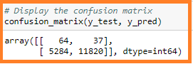

# Credit_Risk_Analysis
New project on credit risk analysis. Creating and evaluating predictor models.

## Project Overview
Credit risk is an inherently unbalanced classification problem, as good loans easily outnumber risky loans. Therefore, different techniques will need to be employed to train and evaluate models with unbalanced classes. `Imbalanced-learn` and `scikit-learn` libraries will be used to build and evaluate models using resampling.

For this analysis, you’ll use Pandas to change the "tripduration" column from an integer to a datetime datatype. Then, using the converted datatype, you’ll create a set of visualizations to:

The credit card credit dataset will be used from LendingClub, a peer-to-peer lending services company; you’ll oversample the data using the RandomOverSampler and SMOTE algorithms, and undersample the data using the ClusterCentroids algorithm. Then, you’ll use a combinatorial approach of over- and undersampling using the SMOTEENN algorithm. Next, you’ll compare two new machine learning models that reduce bias, BalancedRandomForestClassifier and EasyEnsembleClassifier, to predict credit risk. Once done, you’ll evaluate the performance of these models and make a written recommendation on whether they should be used to predict credit risk.

This assignment consists of three (3) technical analysis deliverables and a written report. The following will be submitted:
- Deliverable 1: Use Resampling Models to Predict Credit Risk
- Deliverable 2: Use the SMOTEENN Algorithm to Predict Credit Risk
- Deliverable 3: Use Ensemble Classifiers to Predict Credit Risk
- Deliverable 4: A Written Report on the Credit Risk Analysis (README.md)

These new visualizations alongside the two previoulsy created will be used for the final presentation and analysis to pitch to investors.

## Purpose
The purpose of this project is to  to apply machine learning to solve a real-world challenge: credit card risk.

## Resources
- **Data Source:** `credit_risk_resampling_starter_code.ipynb`, `201908-citibike-tripdata-v2`
- **Software:** `VS Code`, `Jupyer Notebook`, `Anaconda`, `GitHub`

## Credit Risk Analysis Results
>### Oversampling (Naive Random Oversampling and SMOTE Oversampling)
>
>#### Naive Random Oversampling Results
>
>**Balance Accuracy Scores**
>The balance accuracy score is `0.68`
>**Image showing the Balance Accuracy Scores for the Cluster Centroids Undersampling Results:**
>
>
>
>**Confusion Matrix**
>
>**Image showing the Confusion Matrix for the Naive Random Oversampling Results:**
>
>
>
>**Imbalanced Classification Report**
The Precion score is `0.01` and recall scores are highrisk:`0.76` and low risk:`0.59`
>**Image showing the Imbalanced Classification Report for the Naive Random Oversampling Results:**
>
>
>
>#### SMOTE Oversampling Results
>
>**Balance Accuracy Scores**
>The balance accuracy score is `0.66`
>**Image showing the Balance Accuracy Scores for the SMOTE Oversampling Results:**
>
>
>
>**Confusion Matrix**
>
>**Image showing the Confusion Matrix for the SMOTE Oversampling Results:**
>
>
>
>**Imbalanced Classification Report**
>The Precion score is `0.01` and recall scores are highrisk:`0.63` and low risk:`0.69`
>**Image showing the Imbalanced Classification Report for the SMOTE Oversampling Results:**
>
>
>
>### Undersampling (Cluster Centroids)
>
>#### Cluster Centroids Undersampling Results
>
>**Balance Accuracy Scores**
>The balance accuracy score is `0.54`
>**Image showing the Balance Accuracy Scores for the Cluster Centroids Undersampling Results:**
>
>
>
>**Confusion Matrix**
>
>**Image showing the Confusion Matrix for the Cluster Centroids Undersampling Results:**
>
>
>
>**Imbalanced Classification Report**
>The Precion score is `0.01` and recall scores are highrisk:`0.68` and low risk:`0.41`
>**Image showing the Imbalanced Classification Report for the Cluster Centroids Undersampling Results:**
>
>
>
>### Combination (Over and Under) Sampling
>
>#### SMOTEENN Sampling Results
>
>**Balance Accuracy Scores**
>
>The balance accuracy score is `0.64`
>
>**Image showing the Balance Accuracy Scores for the SMOTEENN Sampling Results:**
>
>
>
>**Confusion Matrix**
>
>**Image showing the Confusion Matrix for the SMOTEENN Sampling Results:**
>
>
>
>**Imbalanced Classification Report**
>
>The Precion score is `0.01` and recall scores are highrisk:`0.72` and low risk:`0.57`
>
>**Image showing the Imbalanced Classification Report for the SMOTEENN Sampling Results:**
>
>
>
>### Balanced Random Forest Classifier Results
>
>**Balance Accuracy Scores**
>
>The balance accuracy score is `0.78`
>
>**Image showing the Balance Accuracy Scores for the Balanced Random Forest Classifier Result:**
>
>
>
>**Confusion Matrix**
>
>**Image showing the Confusion Matrix for the Balanced Random Forest Classifier Result:**
>
>
>
>**Imbalanced Classification Report**
>
>The Precion score is `0.03` and recall scores are highrisk:`0.70` and low risk:`0.87`
>
>**Image showing the Imbalanced Classification Report for the Balanced Random Forest Classifier Result:**
>
>
>
>### Easy Ensemble AdaBoost Classifier Results
>
>**Balance Accuracy Scores**
>
>The balance accuracy score is `0.93`
>
>**Image showing the Balance Accuracy Scores for the Easy Ensemble AdaBoost Classifier Result:**
>
>
>
>**Confusion Matrix**
>
>**Image showing the Confusion Matrix for the Ensemble AdaBoost Classifier Result:**
>
>
>
>**Imbalanced Classification Report**
>
>The Precion score is `0.09` and recall scores are highrisk:`0.92` and low risk:`0.94`
>
>**Image showing the Imbalanced Classification Report for the Ensemble AdaBoost Classifier Result:**
>
>
>

## Summary
>Based on the results above the recommended model would have to be the `Easy Ensemble AdaBoost Classifier` model as it yield the best results with `0.93` accuracy score followed by the `Balanced Random Forest Classifier` which produced good results with `0.73` accuracy. The remainder, are not good predictors of credit risk as they all yielded an accuracy of `0.01` 